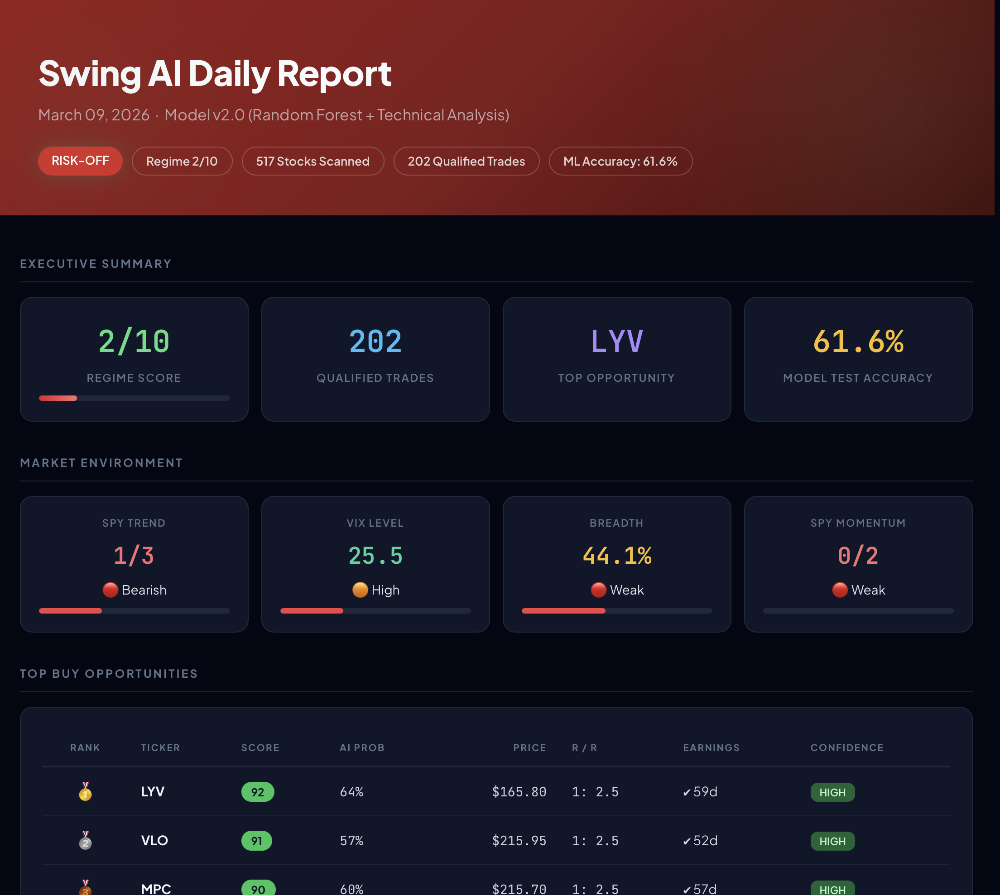
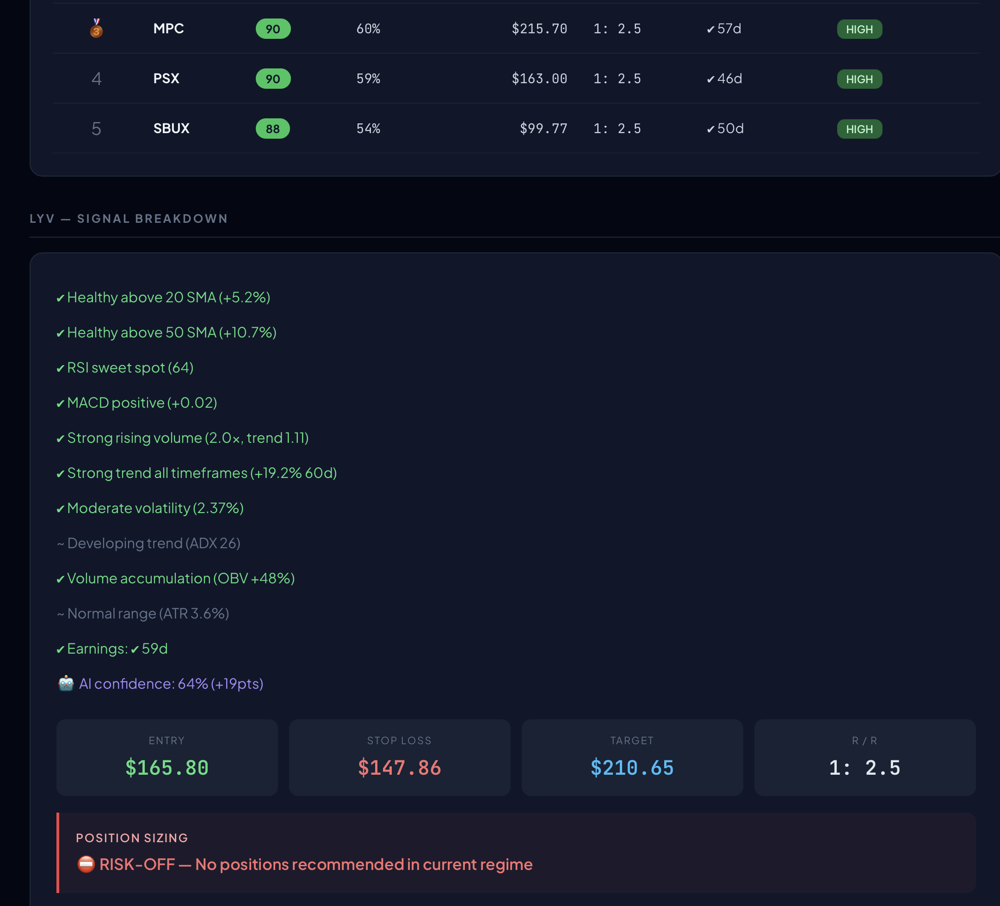
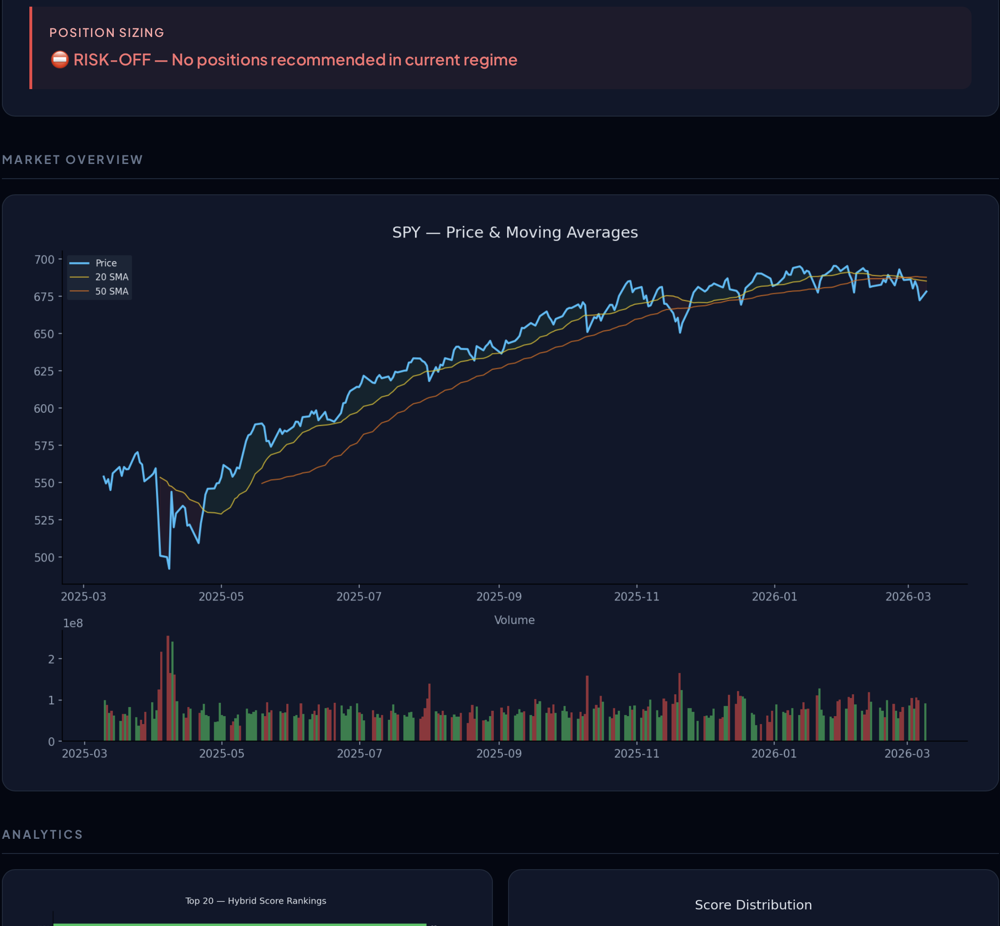

# AI-Powered Stock Market Dashboard in Python

An end-to-end Python project that ingests live market data, engineers technical features, trains a machine learning model on historical stock behavior, scores current opportunities, and generates a polished HTML dashboard for review.

## Overview

This project was built to demonstrate practical skills across data analysis, feature engineering, machine learning, visualization, and reporting.

The system:

- pulls live S&P 500 and Nasdaq-100 constituents from Wikipedia
- downloads market data from Yahoo Finance
- computes technical indicators across a large stock universe
- trains a Random Forest classifier on historical samples
- predicts the probability of 20-day winners
- combines ML outputs with rule-based scoring
- detects overall market regime
- applies ATR-based risk management
- generates a self-contained HTML report with charts, rankings, and trade plans

## Why I Built This

I wanted to build a project that goes beyond a basic notebook and shows the full analytics workflow:

- collecting live external data
- cleaning and validating inputs
- engineering meaningful features
- training and evaluating a model
- turning results into an executive-style deliverable

This project is meant to showcase applied Python, data science, and reporting skills in a real-world style format.

## Key Features

### Data Pipeline
- Scrapes live S&P 500 and Nasdaq-100 membership from Wikipedia
- Uses request headers to avoid common scraping issues
- Downloads daily OHLCV market data with `yfinance`

### Technical Analysis Engine
Computes features such as:
- 20-day and 50-day SMA distance
- RSI
- MACD histogram
- volume ratio
- relative volume trend
- 5-day / 20-day / 60-day returns
- rolling volatility
- ADX
- ATR %
- OBV slope

### Machine Learning
- Trains a `RandomForestClassifier`
- Uses historical feature snapshots as training samples
- Predicts whether a stock will gain more than 5% over the next 20 trading days
- Evaluates model performance on held-out test data

### Hybrid Scoring
Combines:
- rule-based technical scoring
- ML win probability
- earnings timing awareness
- ATR-based risk and target logic

### Market Regime Detection
Scores the broader environment using:
- SPY trend
- VIX level
- market breadth
- short and medium-term momentum

### Reporting
Outputs a dark-themed HTML dashboard with:
- KPI cards
- market regime summary
- top-ranked stocks
- trade plans
- signal breakdowns
- embedded charts

## Example Output

The final deliverable is a self-contained HTML report that includes:
- top trade candidates
- AI confidence by ticker
- stop-loss and target levels
- score rankings
- feature importance chart
- market regime summary

## Screenshots

### Executive Summary


### Signal Breakdown


### SPY Graph


## Tech Stack

- Python
- pandas
- numpy
- yfinance
- ta
- matplotlib
- scikit-learn
- requests
- lxml
- JupyterLab

## Project Structure

```text
ai-stock-market-report/
│
├── notebook/
│   └── ai_stock_market_report.ipynb
├── output/
│   └── position_ai_report.html
├── images/
│   ├── exec_summary.png
│   ├── signal_breakdown.png
│   └── spy_graph.png
├── requirements.txt
└── README.md
```

## How to Run

### 1. Clone the repository

```bash
git clone https://github.com/ramonrodriguezc23/ai-stock-market-report.git
cd ai-stock-market-report
```

### 2. Install dependencies

```bash
pip install -r requirements.txt
```

### 3. Launch JupyterLab

```bash
jupyter lab
```

### 4. Open the notebook

Run the notebook cells in order to:
- fetch live stock universes
- download market data
- compute technical indicators
- train the model
- score live candidates
- generate the HTML report

## Limitations

- Data sources such as Yahoo Finance and Wikipedia may change or fail
- Market behavior changes over time, so model performance may degrade
- The project uses free public data rather than institutional-grade feeds
- Earnings calendar data may occasionally be incomplete
- This is not a production trading system

## What This Project Demonstrates

This project highlights my ability to:
- build an end-to-end Python analytics workflow
- work with live external data sources
- engineer business-relevant features
- train and evaluate ML models
- communicate outputs through polished reporting
- structure a project as a portfolio-ready deliverable

## Disclaimer

This project is for educational and portfolio purposes only. It is not financial advice, investment advice, or a recommendation to buy or sell securities.
